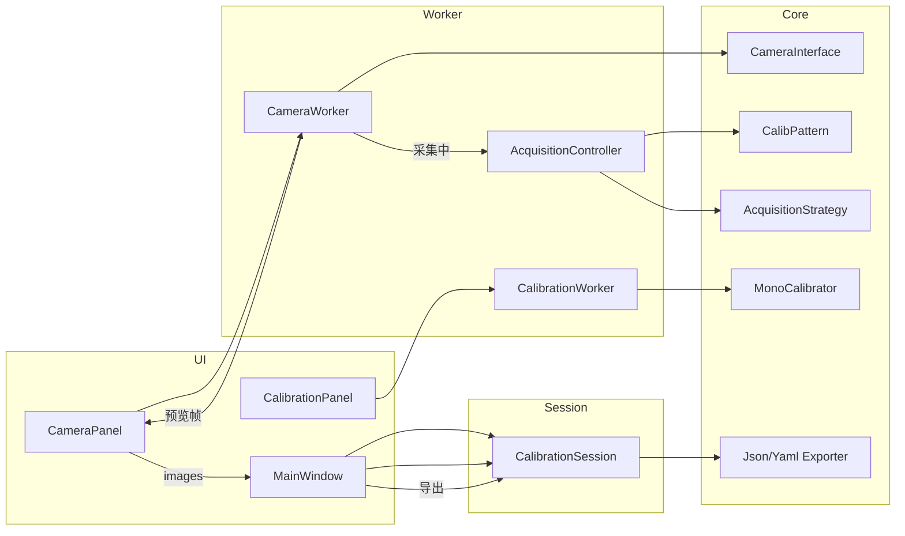

# CalibTool — 桌面相机标定工具

基于 **Qt (PySide6) + Python + OpenCV** 的相机内参标定桌面程序。  
第一阶段 MVP：USB 连接 Basler 相机 → 实时预览 → 自动采集标定图 → 单目标定 → 导出 JSON/YAML。

后续规划：多品牌相机、多种标定板、双目标定、多相机标定、在线微调。

---

## 快速开始

### 环境

- Python ≥ 3.10
- Basler 相机需安装 [Pylon SDK](https://www.baslerweb.com/) 及 `pypylon`
- 推荐在虚拟环境中安装依赖

### 安装与运行

```bash
cd calib
python -m venv .venv
.venv\Scripts\activate          # Windows
pip install -e .

# 启动（任选其一）
python -m calib
calib-tool
python main.py                  # 兼容入口
```

### 基本流程

1. 选择相机品牌（默认 Basler），点击 **连接**
2. 在右侧设置标定板类型与行列数，点击 **开始采集**，移动标定板直至进度完成
3. 点击 **开始标定**，查看重投影误差与内参
4. 选择 **json** 或 **yaml**，点击 **导出**（默认目录：`output/`）

### 运行测试

```bash
pip install -e .
python -m unittest discover -s tests -p "test_*.py"
```

---

## 项目架构

采用 **分层 + 工厂 + 会话编排** 结构：业务逻辑与 Qt 解耦，UI 只负责交互，耗时操作放在 `worker/` 线程中。

```
calib/                          # 项目根（仓库内路径 toolbox/calib）
├── pyproject.toml              # 包定义、依赖、pytest 配置
├── requirements.txt            # 与 pyproject 同步的依赖列表（便于 pip install -r）
├── README.md
├── main.py                     # 兼容入口，转调 calib.app.main
├── config/                     # （无，配置在包内 src/calib/config/）
├── data/                       # 运行时采集的原始图（gitignore）
├── output/                     # 标定结果导出目录（gitignore）
├── src/
│   └── calib/                  # 可安装 Python 包 `calib`
│       ├── __init__.py         # 版本号、project_root()、default_output_dir()
│       ├── __main__.py         # python -m calib
│       ├── app.py              # QApplication 启动
│       ├── config/             # 配置加载
│       ├── core/               # 核心业务（无 Qt）
│       ├── ui/                 # Qt 界面
│       └── worker/             # Qt 后台线程
└── tests/                      # 单元测试
```

### 数据流（MVP）



---

## 目录与文件说明

### 根目录

| 文件/目录 | 作用 |
|-----------|------|
| `pyproject.toml` | 包元数据、`calib-tool` 控制台入口、`src` 布局、pytest `pythonpath` |
| `requirements.txt` | 依赖清单（`pip install -r requirements.txt` 时可用） |
| `main.py` | 旧式启动兼容，内部调用 `calib.app.main` |
| `data/` | 自动采集的原始标定图（可选持久化，默认 gitignore） |
| `output/` | 导出的 `camera_intrinsics.json` / `.yaml` |
| `tests/` | 单元测试，不随包发布 |

### `src/calib/` — 应用包

| 文件 | 作用 |
|------|------|
| `__init__.py` | `__version__`；`package_root()` / `project_root()` / `default_output_dir()` 路径工具 |
| `__main__.py` | 模块入口 `python -m calib` |
| `app.py` | 加载 `defaults.yaml`、创建 `output/`、启动 `MainWindow` |

### `config/` — 配置

| 文件 | 作用 |
|------|------|
| `defaults.yaml` | 默认标定板、采集策略、标定 flags、窗口尺寸、导出格式等 |
| `app_config.py` | YAML → `AppConfig` 及子 dataclass（`PatternConfig`、`AcquisitionConfig` 等） |
| `__init__.py` | 导出配置类型 |

**`defaults.yaml` 主要字段：**

- `pattern`：板型（`chessboard` / `charuco` / `circle_grid`）、行列、方格尺寸 (mm)
- `acquisition`：策略名（`simple`）、目标张数、采集间隔、模糊阈值
- `calibration`：OpenCV `calibrateCamera` 的 flags 与迭代参数
- `ui`：窗口标题、大小、预览最大 FPS
- `export`：输出目录（空则用 `output/`）、默认格式

### `core/` — 核心业务（与 Qt 无关）

| 模块 | 作用 |
|------|------|
| **`session.py`** | **`CalibrationSession`**：编排连接相机、创建板型/策略/标定器、导出；UI 通过它访问业务 |
| **`models/calibration_result.py`** | `build_export_payload()`：将标定结果 + 标定板信息组装为导出字典 |
| **`camera/interface.py`** | `CameraInterface` 抽象基类：open/grab/曝光/增益等 |
| **`camera/basler_camera.py`** | Basler + pypylon 实现 |
| **`camera/uvc_camera.py`** | UVC 通用相机（调试/无 Basler 时） |
| **`camera/factory.py`** | `CameraFactory`：按品牌名创建相机，支持 `register_camera()` 扩展 |
| **`pattern/base.py`** | `CalibPatternBase`：检测角点、物体点、绘制 |
| **`pattern/chessboard.py`** | `CalibPatternChessboard` 棋盘格 |
| **`pattern/charuco.py`** | ChArUco |
| **`pattern/circle_grid.py`** | 圆点阵 |
| **`pattern/factory.py`** | `PatternFactory`：按类型创建标定板 |
| **`acquisition/base.py`** | `AcquisitionStrategy`：是否采集当前帧 |
| **`acquisition/simple.py`** | 简易策略：检测到板 + 清晰 + 时间间隔 + 姿态变化 |
| **`acquisition/coverage.py`** | 覆盖度策略（**stub**，尚未实现） |
| **`acquisition/quality.py`** | 图像质量辅助（模糊等，供策略复用） |
| **`acquisition/factory.py`** | `create_acquisition_strategy(cfg)`：按配置实例化策略 |
| **`calibration/base.py`** | `CalibratorBase`：单目/双目/多机标定统一接口 |
| **`calibration/mono.py`** | `MonoCalibrator`、`MonoCalibResult`：单目 `cv2.calibrateCamera` |
| **`calibration/stereo.py`** | 双目标定（**stub**） |
| **`calibration/multi.py`** | 多相机标定（**stub**） |
| **`export/json_exporter.py`** | 写入 JSON |
| **`export/yaml_exporter.py`** | 写入 YAML |

### `ui/` — Qt 界面

| 文件 | 作用 |
|------|------|
| `main_window.py` | 主窗口：信号连接、调用 `CalibrationSession`、状态栏 |
| `camera_panel.py` | 品牌选择、连接/断开、预览、采集进度；驱动 `CameraWorker` / `AcquisitionController` |
| `calibration_panel.py` | 开始标定、误差表/图、导出格式；驱动 `CalibrationWorker` |
| `pattern_selector.py` | 标定板类型与几何参数 UI |
| `widgets/image_viewer.py` | 实时图像显示 |
| `widgets/error_chart.py` | 逐张重投影误差柱状图 |

### `worker/` — Qt 后台线程

| 文件 | 作用 |
|------|------|
| `camera_worker.py` | `QThread`：循环 `grab()`，限 FPS，发出 `frame_ready` |
| `acquisition_worker.py` | **`AcquisitionController`**（`QObject` + 独立 `QThread`）：角点检测、采集策略、预览叠加；避免阻塞 UI |
| `calibration_worker.py` | `QThread`：后台执行 `MonoCalibrator.calibrate` |

### `tests/`

| 文件 | 作用 |
|------|------|
| `test_camera_interface.py` | 相机接口与工厂注册 |
| `test_pattern.py` | 标定板检测与工厂 |
| `test_calibration.py` | 单目标定（合成数据） |
| `test_export.py` | JSON/YAML 导出 |
| `test_acquisition_factory.py` | 采集策略工厂 |

---

## 扩展指南（路线图）

| 需求 | 建议改动位置 |
|------|----------------|
| 新相机品牌 | 实现 `CameraInterface` → `camera/factory.py` 注册；可选 `plugins/cameras/` |
| 新标定板 | 继承 `CalibPatternBase` → `pattern/factory.py` |
| 新采集策略 | 继承 `AcquisitionStrategy` → `acquisition/factory.py` |
| 双目标定 | 实现 `StereoCalibrator(CalibratorBase)`，扩展 `CalibrationSession` |
| 多相机 | 实现 `MultiCalibrator`，UI 增加多路预览 |
| 在线微调 | 在 `session` 中加载已有 JSON，增量采集 + 优化 |

---

## 依赖

| 包 | 用途 |
|----|------|
| PySide6 | Qt 6 桌面 UI |
| opencv-python | 角点检测、`calibrateCamera` |
| numpy | 数组与矩阵 |
| pypylon | Basler 相机 |
| PyYAML | 配置与导出 |
| pyqtgraph | 误差图表（`error_chart`） |

---

## 许可证

与上层 `toolbox` 仓库保持一致（若未单独声明，以仓库根目录为准）。
